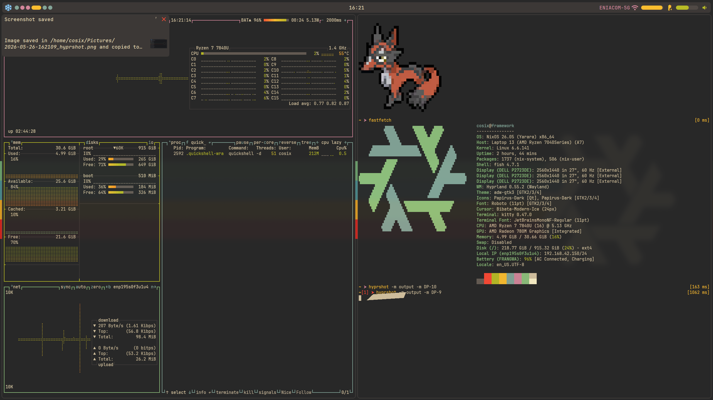

# Frame Shell

> A polished Wayland shell built with [Quickshell](https://quickshell.outfoxxed.me/) for Hyprland.

<https://github.com/user-attachments/assets/showcase.mp4>



---

## Overview

Frame Shell is a fully-featured desktop shell built on top of Quickshell and the Hyprland compositor. Every component is written in QML with smooth, physics-inspired animations throughout. The shell is multi-monitor aware — panels and overlays always appear on the focused monitor.

---

## Features

### Bar

A top panel rendered on every connected screen, split into three sections.

| Section | Contents |
|---------|----------|
| Left | Logo · Workspace indicators |
| Center | Clock |
| Right | System tray · Network status · Volume · Battery |

- **Workspaces** — up to 6 pill-shaped indicators that expand when focused and change colour depending on whether a workspace is empty, occupied, or active.
- **Battery** — progress bar with charging/discharging icon set; hovering reveals the percentage.
- **System Tray** — native Wayland/SNI tray with per-icon context menus.

---

### Dashboard

A slide-in panel anchored to the right edge of the focused monitor. Toggle it with the `dashboard` global shortcut. Closes automatically when focus leaves it.

| Section | Controls |
|---------|----------|
| Wi-Fi | Toggle on/off, expand to browse and connect to networks |
| Bluetooth | Toggle, discover nearby devices, pair / forget / connect |
| Volume | Slider for the default audio sink |
| Brightness | Slider backed by `brightnessctl` |
| Media Players | Album art, track title, playback controls (MPRIS) |
| Power Profile | Cycle between **Power Saver → Balanced → Performance** |

---

### App Launcher

A centered overlay with a live-filter search field and a scrollable grid of installed applications.

- Triggered by the `applauncher` global shortcut.
- Closes on `Escape` or when focus leaves the window.
- Applications launch on click.

---

### Notifications

Stacked notification cards in the top-left corner of the focused monitor.

- Cards animate in with a **pop-in** effect and stack with decreasing scale and opacity.
- The frontmost card shows a **pie countdown** timer.
- Drag a card past a threshold to **dismiss** it (the card wiggles to signal the threshold).
- Cards auto-expire when their timeout elapses.
- Supports notification images.

---

### Audio Mixer

A full PipeWire mixer panel anchored to the right edge, toggled by the `mixer` global shortcut.

- Lists every active **audio sink** (output device) and **stream** (application).
- Per-entry **mute toggle** and **volume slider** (0–100 %).
- Mark any sink as the **default output** with one click.

---

### Network Dashboard

A dedicated Wi-Fi panel (also right-anchored) that opens when you click the network indicator in the bar.

- Shows the currently connected SSID and signal level.
- Scans for nearby networks and lists them with signal strength.
- Connect to open or password-protected networks.
- Disconnects / forgets saved networks.

---

### Power Actions

A bottom-center overlay triggered by the `poweractions` global shortcut.

- **Lock** — runs `hyprlock`.
- **Reboot** — hold-to-confirm button.
- **Shutdown** — hold-to-confirm button.

---

### Volume OSD

A slim bar that slides up from the bottom of the screen whenever the default audio sink volume changes. Disappears automatically after 1.5 seconds.

---

## Dependencies

| Dependency | Purpose |
|------------|---------|
| [Quickshell](https://quickshell.outfoxxed.me/) | Shell framework |
| [Hyprland](https://hyprland.org/) | Wayland compositor |
| PipeWire | Audio (Mixer, Volume OSD, Dashboard volume) |
| NetworkManager | Wi-Fi management |
| BlueZ | Bluetooth |
| UPower | Battery |
| `brightnessctl` | Screen brightness |
| `hyprlock` | Screen lock |
| `power-profiles-daemon` | Power profile switching |
| A Material Symbols font | Icons throughout the shell |

---

## Installation

```sh
git clone https://github.com/Numb-0/frame-shell ~/.config/quickshell
quickshell
```

Config values (corner rounding, spacing) live in `config/config.json` and are hot-reloaded on save.

Theme colours follow the [base16](https://github.com/tinted-theming/home) scheme and are defined in `config/Theme.qml`.

---

## Structure

```
quickshell/
├── shell.qml                  # Entry point
├── config/                    # Theme & config singletons
├── services/                  # Brightness, power profile helpers
├── utils/
│   ├── animations/            # Reusable animation components
│   ├── behaviors/             # Color transition behavior
│   └── components/            # Shared UI primitives
└── widgets/
    ├── Bar.qml                # Top bar
    ├── Dashboard.qml          # Right-side control panel
    ├── Applauncher.qml        # App search overlay
    ├── Notifications.qml      # Notification stack
    ├── Mixer.qml              # PipeWire audio mixer
    ├── NetworkDashboard.qml   # Wi-Fi panel
    ├── PowerActions.qml       # Lock / reboot / shutdown
    └── VolumeOSD.qml          # Volume on-screen display
```
